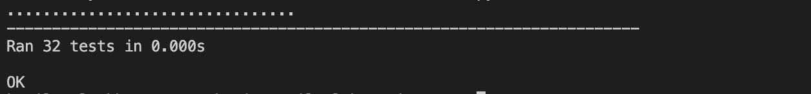
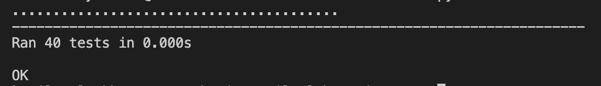
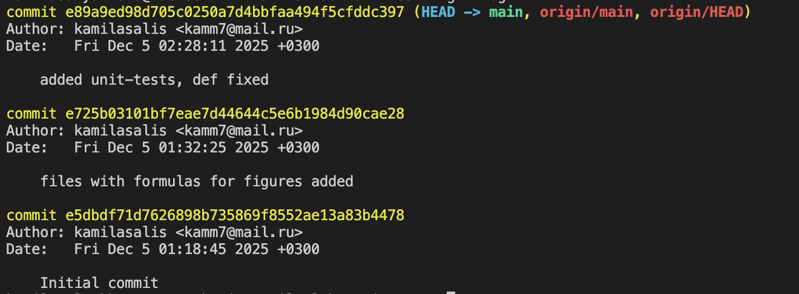

# Лабораторная работа №4
Тема: Написание Unit-тестов на Python

Студент: Камила Саляхова
Группа: M3100

# 1. Цели и задачи тестирования
Целью тестирования является проверка корректности реализации функций вычисления площади и периметра геометрических фигур: квадрата, прямоугольника, треугольника и круга.

## Основные задачи:
	•	подтвердить математическую корректность реализованных алгоритмов;
	•	выявить ошибки в вычислениях на различных наборах входных данных;
	•	проверить устойчивость функций к некорректному вводу;
	•	обеспечить надёжность библиотеки с помощью автоматического тестирования;
	•	продемонстрировать навыки работы с модулем unittest.

# 2. Описание тестируемого продукта
### Тестируемый продукт включает библиотеку **geometric_lib**, состоящую из модулей:
- **square.py** — вычисление площади и периметра квадрата;
- **rectangle.py** — функции вычисления площади и периметра прямоугольника;
- **triangle.py** — функции вычисления площади и периметра треугольника;
- **circle.py** — функции вычисления площади круга и длины окружности.

### Каждая функция:
- принимает числовые аргументы (положительные или ноль);
- возвращает вычисленное значение;
- выбрасывает исключение `ValueError` при передаче отрицательных параметров.
- выбрасывает исключение `TypeError` при передаче аргументов, неявляющихся числами.
Продукт должен выполнять математически корректные операции и быть устойчивым к ошибкам пользователя.

# 3. Область тестирования

## В область тестирования входят:

**Функции:**
- area() для всех четырёх фигур;
- perimeter() для всех фигур.

**Типы данных:**
- 	положительные числа;
- 	нулевые значения;
- 	отрицательные значения (ожидаем ValueError);
-   передача аргументов не числовых типов данных (ожидаем TypeError);
- 	большие числа;
- 	дробные значения.


# 4. Стратегия тестирования

Стратегия тестирования основана на модульном подходе:

### Методы тестирования:
- 	функциональное тестирование — проверка соответствия математическим формулам;
- 	позитивное тестирование — корректные входные значения;
- 	негативное тестирование — проверка обработки ошибок (ValueError);
- 	передача неправильных аргументов — проверка обработки ошибок (TypeError);
- 	граничные значения — ноль, маленькие и большие числа;
- 	автоматизированные unittest-тесты.

### Инструменты:
- 	Python 3.x
- 	модуль unittest
- 	структура тестов в каталоге tests/

### Каждый тест:
- 	оформлен в классе, наследующем unittest.TestCase;
- 	начинается с test_;
- 	использует методы assertEqual, assertAlmostEqual, assertRaises.

# 5. Критерии приёмки

Продукт считается прошедшим тестирование, если:
- 	все функции возвращают корректные математические значения;
- 	отрицательные аргументы вызывают ValueError;
-   передача неправильных аргументов вызывает TypeError;
- 	набор unit-тестов выполняется полностью, без ошибок;
- 	структура кода соответствует требованиям лабораторной работы;
- 	тесты и программа размещены в GitHub с прозрачной историей коммитов;
- 	результаты тестирования задокументированы.

# 6. Ожидаемые результаты

Ожидаемые результаты:
- 	полный набор тестов, покрывающий ключевые сценарии использования;
- 	отсутствие ошибок в математических вычислениях;
- 	корректная обработка некорректных аргументов;
- 	вывод unittest:
    ```py
    Ran XX tests
    OK
    ```

# 7. Актуальные результаты тестирования

**По результатам запуска тестов была выполнена команда:**
```
python3 -m unittest discover -s tests   
```
**Фактический вывод:**


**Если захочется запустить не все тесты, а лишь для одной фигуры, то используем команду(пример для rectangle):**
```
python3 -m unittest tests.test_rectangle
```
**Результат:**


# 8. История изменений (GitHub Commits)
Ниже представлены коммиты, отражающие появление тестов и доработку функций:
- Первоначальный коммит
- Создание файлов, осуществляющих работу библиотеки geometric_lib
- Добавление тестов

**Скриншот истории коммитов:**


# 9. Выводы

В ходе выполнения лабораторной работы были разработаны функции для вычисления площади и периметра геометрических фигур, а также набор модульных тестов, проверяющих корректность их работы.  

Все тесты были успешно пройдены, ошибки в вычислениях не обнаружены.  
Обработка некорректных данных реализована корректно, предусмотрены исключения `ValueError` и `TypeError`.

Тесты добавлены в проектную структуру и размещены в репозитории GitHub.
Поставленные цели лабораторной работы полностью достигнуты.